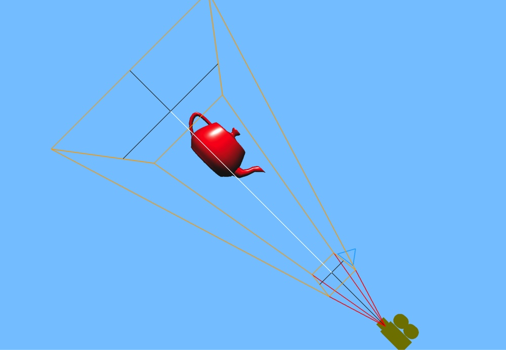

# 视图平截锥体（view frustum）几何体渲染
threejs中webgl_camera例子中渲染出了视图平截锥体的形状，其实现了frustum geometry对象用于专门负责view frustum几何体数据的生成。

下面我们仿照threejs中camera的实现原理使用C++在OpenGL ES上实现view frustum几何形状的渲染。[iOS项目源码](https://github.com/nintymiles/LearnThreeJSRenderingExamples)可从github中获取。

**渲染效果图如下**



## 视图平截锥体（view frustum）几何体数据的生成
要绘制view frusutum，首先需要确定frustum形状的几何数据。由于我们只是要绘制出frustum的基础轮廓，因而我们会准备相关线段的顶点以及顶点色彩属性数据。我们对顶点数据的准备会分为两个步骤。

### 1. 根据眼睛空间中frustum的典型形状，大略准备出顶点数据
投射变换矩阵参数会在眼睛空间中确定出一个view frusutum，在本文中，我门使用右手性的投射矩阵（right handedness），因此，我们的frustum应该完全位于眼睛空间的负z轴之上。通常情况下，我们通过fov，aspect ratio和near/far平面z值参数确定出frustum。借助这些参数，其实我们可以计算出frustum的顶点数据。但是，这种方式不是很方便，因为每次都要确定顶点的位置信息，而同类的信息我们在生成投射矩阵时还要再次确定。所以，在第一步中，我们只是指出顶点数据的大略信息，比如顶点的数目，还有每个顶点要绘制的色彩信息，而顶点的位置数据我们在第二步中处理，在第一步只是给出占位信息。我们需要设置的顶点数据如下代码实例中所展示：

```cpp
    // 线段的色彩信息
    Cvec3 colorFrustum = hexStringToRGB("0xffaa00");
    Cvec3 colorCone = hexStringToRGB("0xff0000");
    Cvec3 colorUp = hexStringToRGB("0x00aaff");
    Cvec3 colorTarget = hexStringToRGB("0xffffff");
    Cvec3 colorCross = hexStringToRGB("0x333333");
    
    //注意：下面每段中每个点的名称，这些名称代表了frustum锥体每个顶点的名称
    
    // 近平面方形的四条线段和对应色彩
    addLine( "n1", "n2", colorFrustum );
    addLine( "n2", "n4", colorFrustum );
    addLine( "n4", "n3", colorFrustum );
    addLine( "n3", "n1", colorFrustum );
    
    // 远平面方形的四条线段和对应色彩
    addLine( "f1", "f2", colorFrustum );
    addLine( "f2", "f4", colorFrustum );
    addLine( "f4", "f3", colorFrustum );
    addLine( "f3", "f1", colorFrustum );

    // 从近平面到远平面锥体边缘线段和色彩
    addLine( "n1", "f1", colorFrustum );
    addLine( "n2", "f2", colorFrustum );
    addLine( "n3", "f3", colorFrustum );
    addLine( "n4", "f4", colorFrustum );
    
    // 从眼睛坐标原点到近平面的锥体顶端线段和色彩
    addLine( "p", "n1", colorCone );
    addLine( "p", "n2", colorCone );
    addLine( "p", "n3", colorCone );
    addLine( "p", "n4", colorCone );
    
    // 指示上方方向的三角形线段和色彩
    addLine( "u1", "u2", colorUp );
    addLine( "u2", "u3", colorUp );
    addLine( "u3", "u1", colorUp );

    // 锥体中线线段和色彩
    addLine( "c", "t", colorTarget );
    addLine( "p", "c", colorCross );

    // 近平面和远平面中间轴对齐十字线线段和色彩
    addLine( "cn1", "cn2", colorCross );
    addLine( "cn3", "cn4", colorCross );

    addLine( "cf1", "cf2", colorCross );
    addLine( "cf3", "cf4", colorCross );
    
    
    ...
    
    //其中，每个addLine确定两个顶点信息
    void addLine(string a,string b,Cvec3 color){
      addPoint(a, color);
      addPoint(b, color); 
    }
    
    
    //对于每个顶点的位置信息，我们只是记录占位信息，这些占位信息在第二步更新
    void addPoint(string id, Cvec3 color){
      //存储每个点的占位位置信息
      vertices.push_back(Cvec3(0,0,0));
      //存储每个点的色彩信息
      colors.push_back(color);
    
      //我们使用GL_LINES primtive类型绘制线段，每个线段由两个点确定，
      //根据我们的绘制方式，那么相对于锥体的每个真实顶点，这些线段会多次使用锥体的每个顶点。
      //所以，我们会记录每个顶点的使用详情，便于在第二步更新时根据顶点名称更新真实位置信息
      if (pointMap.find(id)==pointMap.end()){
          pointMap[id] = vector<int>();
      }
      pointMap[id].push_back((int)vertices.size() - 1);
    }
```

### 2. 更新frustum锥体每个顶点的位置信息
在OpenGL中，投射矩阵将视图平截锥体变换为经典立方体（经透视除法-perspective division-之后）。如果要渲染view frustum，关键在于如何生成view frustum几何体。如果我们在眼睛空间直接描述，则面临着针对每一种不同的view frustum规格（投射矩阵参数所确定），都要根据参数重新指定view frustum的各个顶点。但是假如我们变换角度，从标准化设备空间的经典立方体开始，则很容易获得眼睛空间中view frustum各顶点的眼睛坐标。

经典立方体各顶点的坐标很容易确定，并且是固定不变的。因为经典立方体在x/y/z轴的坐标区间都是[-1..1]。因而我们可以轻松确定view frustum近平面和远平面上的8个顶点，加上眼睛坐标的原点和远近平面的中心点。那么这几乎就是我们需要的所有顶点。

我们可以设置顶点如下：

```cpp
	  int w = 1, h = 1;
    
    // 近平面和远平面中心点
    setPoint( "c", 0, 0, 1 );
    setPoint( "t", 0, 0, -1 );
    
    // 近平面顶点
    setPoint( "n1", - w, - h, 1 );
    setPoint( "n2", w, - h, 1 );
    setPoint( "n3", - w, h, 1 );
    setPoint( "n4", w, h, 1 );
    
    // 远平面顶点
    setPoint( "f1", - w, - h, -1 );
    setPoint( "f2", w, - h, -1 );
    setPoint( "f3", - w, h, -1 );
    setPoint( "f4", w, h, -1 );
    
    // 指示向上方向的三角形顶点
    setPoint( "u1", w * 0.7, h * 1.1, 1 );
    setPoint( "u2", - w * 0.7, h * 1.1, 1 );
    setPoint( "u3", 0, h * 2, 1 );
    
    // 远平面十字相交线顶点
    setPoint( "cf1", - w, 0, -1 );
    setPoint( "cf2", w, 0, -1 );
    setPoint( "cf3", 0, - h, -1 );
    setPoint( "cf4", 0, h, -1 );
    
    // 近平面十字相交线顶点
    setPoint( "cn1", - w, 0, 1 );
    setPoint( "cn2", w, 0, 1 );
    setPoint( "cn3", 0, - h, 1 );
    setPoint( "cn4", 0, h, 1 );
```

要获得这些顶点对应的眼睛坐标，我们还需要投射矩阵，利用这个矩阵的反转矩阵，我们就可以获得各顶点的眼睛坐标。经过反转投射变换后，近平面被投射到眼睛坐标中view frustum的近平面之上，远平面被投射到对应的远平面之上。注意，反转投射后，我们所获得的点和投射变换所获得的点一样，都为同质坐标，需要将坐标的各个部件都除以第4部件，来获得眼睛空间的仿射坐标。那么，获得眼睛坐标的代码示例如下：

```cpp
void setPoint(string p,float x,float y,float z){
    //先将ndc坐标反转投射为eye coordinate
    Cvec4 eyeP4 = inv(projMat) * Cvec4(x,y,z,1.0);
    //点的同质坐标需要转换为标准仿射坐标
    Cvec4 eyeP4Affine = eyeP4/eyeP4[3];
    Cvec3 eyePos = Cvec3(eyeP4Affine);
    
    //根据顶点名称，更新vertices中占位位置信息的真实值
    vector<int> points = pointMap[p];
    if (points.size()>0) {
        for (int i = 0, l = (int)points.size(); i < l; i ++ ) {
            vertices[points[i]] = eyePos;
        }   
    } 
}
```

至此，我们就获得了frustum锥体几何形状绘制所需的顶点信息，剩下的就是使用OpenGL将这个信息绘制出来。


