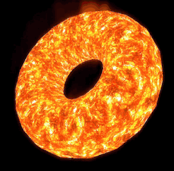
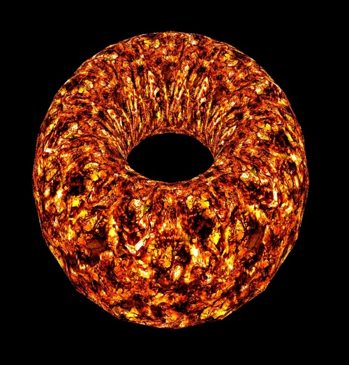
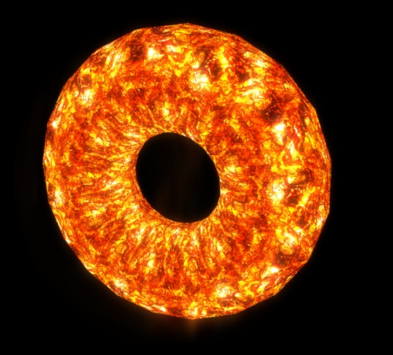

# 火山熔岩效果（lava effect）渲染
threejs中的webgl_lava例子实现了火山熔岩效果的渲染。

## 实现原理
首先使用火山和云纹理（noise），借助跟随时间变化的特殊纹理移位shader实现熔岩的基本动态效果。
随后，使用高斯模糊算法在水平和垂直方向进行闪光模糊。
最后，将原始渲染纹理和闪光效果纹理进行合成，生成最终的渲染效果。
整个渲染过程使用了多个渲染通道。

## 基本熔岩动态效果渲染

实际上，在使用了熔岩纹理和动态纹理移位效果的shader渲染后，初始场景已经具备了熔岩的基本外观，但是在细节上，还有点欠缺，比如熔岩核心不够亮，外围黑斑处也没有出现足够暗的效果。

## 使用高斯模糊算法实现发光效果
使用了convolution shader渲染后，在水平和垂直方向执行了高斯模糊之后，渲染图像的亮度明显加强。并且threejs的算法并没有执行专门的亮度算法，但是获得不错的效果。

注：此处，FBO和对应纹理的管理是一个问题，如果要适应窗口的变化，则需要随时清理生成的用于多通道的FBO和纹理。否则，系统资源不可避免的会超载。

