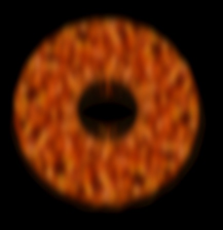

# 火山熔岩效果（lava effect）渲染
three.js中的webgl_lava例子实现了火山熔岩效果的渲染。火山熔岩效果的渲染过程比较繁琐，借助了复杂的移位纹理和高斯模糊算法。

## 实现原理
首先使用火山和扰动（noise）纹理，借助跟随时间变化的特殊纹理移位shader实现熔岩的基本动态效果。
随后，使用高斯模糊算法在水平和垂直方向进行闪光模糊。
最后，将原始渲染纹理和闪光效果纹理进行合成，生成最终的渲染效果。
整个渲染过程使用了多个渲染通道。

模仿webgl_lava例子的这个过程，使用C++和OpenGL ES 3.0获得了如下的渲染效果，[iOS版本实现源码](https://github.com/nintymiles/LearnThreeJSRenderingExamples)可以从github上获取。


## 基本熔岩动态效果渲染
第一个通道要实现熔岩的基本效果的动态渲染。我们加载一个基本的3D环形几何体（torus），在three.js例子中使用了专用的着色器进行渲染，并将这个通道的渲染结果存储为纹理。

```glsl
#version 300 es
precision highp float;

uniform float time;

uniform float fogDensity;
uniform vec3 fogColor;

uniform sampler2D texture1;
uniform sampler2D texture2;

in vec2 vUv;

out vec4 fragColor;

void main( void ) {
    //把纹理坐标域更改为canonical域
    vec2 position = - 1.0 + 2.0 * vUv;
    
    //使用cloud纹理作为扰动值（noise）
    vec4 noise = texture(texture1, vUv);
 
    //生成随时间朝向不同方向运动的移位纹理坐标值
    vec2 T1 = vUv + vec2( 1.5, - 1.5 ) * time * 0.02;
    vec2 T2 = vUv + vec2( - 0.5, 2.0 ) * time * 0.01;

    //使用扰动纹理对纹理坐标进行扰动处理，对不同维度采用不同的处理方式
    T1.x += noise.x * 2.0;
    T1.y += noise.y * 2.0;
    T2.x -= noise.y * 0.2;
    T2.y += noise.z * 0.2;

    //获取扰动纹理的alpha值
    float p = texture(texture1, T1 * 2.0).a;
    
    //使用一个移位纹理坐标获取火山熔岩纹理的色彩
    vec4 color = texture(texture2, T2 * 2.0);
    //对获取的熔岩色彩各部件根据扰动纹理进行程度变化，同时根据部件本身的强度进行变化
    vec4 temp = color * ( vec4( p, p, p, p ) * 2.0 ) + ( color * color - 0.1 );

    if( temp.r > 1.0 ) { temp.bg += clamp( temp.r - 2.0, 0.0, 100.0 ); }
    if( temp.g > 1.0 ) { temp.rb += temp.g - 1.0; }
    if( temp.b > 1.0 ) { temp.rg += temp.b - 1.0; }

    fragColor = temp;

    float depth = gl_FragCoord.z;
    const float LOG2 = 1.442695;
    float fogFactor = exp2( - fogDensity * fogDensity * depth * depth * LOG2 );
    fogFactor = 1.0 - clamp( fogFactor, 0.0, 1.0 );

    fragColor = mix( fragColor, vec4( fogColor, fragColor.w ), fogFactor );
}
```

实际上，在使用了熔岩纹理和动态纹理移位效果的shader渲染后，初始场景已经具备了熔岩的基本外观，但是在细节上，还有点欠缺，比如熔岩核心不够亮，外围黑斑的效果不够柔和。


## 使用高斯模糊算法实现发光效果
第二和第三通道使用第一通道的纹理作为输入，分别在水平和垂直方向执行高斯模糊算法，高斯模糊算法减弱图像的整体锐度，柔化图像使得图像整体呈现模糊的感觉。注意，这两个通道基本的渲染方式为使用正交投射方式绘制四边形，并且将渲染结果也存储为纹理。

```glsl
//vertex shader
#version 300 es
//卷积内核的最大数目
const float KERNEL_SIZE_FLOAT=25.0;
uniform mat4 uModelViewProjectionMatrix;
//水平或者垂直纹理坐标增量
uniform vec2 uImageIncrement;

layout(location = 0) in vec3  position;
layout(location = 1) in vec3  normal;
layout(location = 2) in vec2  uv;

out vec2 vUv;

void main() {
    //在vertex shader中先计算出要进行混合的最大偏离值的纹理坐标
    vUv = uv - ((KERNEL_SIZE_FLOAT-1.0)/2.0) * uImageIncrement;
    gl_Position = uModelViewProjectionMatrix * vec4(position, 1.0);
}
```


```glsl
//fragment shader
#version 300 es
precision highp float;
//卷积内核的最大数目
const int KERNEL_SIZE_INT = 25;
//使用uniform方式传入高斯方程式计算的权重值
uniform float cKernel[KERNEL_SIZE_INT];
//正常渲染图像所保存的纹理
uniform sampler2D tDiffuse;
//水平或者垂直方向纹理坐标增量值
uniform vec2 uImageIncrement;
//从vertex shader中传入的经过差值的最大偏离纹理坐标
in vec2 vUv;

out vec4 fragColor;
void main() {
    vec2 imageCoord = vUv;
    vec4 sum = vec4( 0.0, 0.0, 0.0, 0.0 );
    for( int i = 0; i < KERNEL_SIZE_INT; i ++ ) {
        //使用高斯权重对附近的像素逐个混合
        sum += texture(tDiffuse, imageCoord) * cKernel[i];
        //每次混合的纹理坐标以最大偏离值逐渐增加增量值的方式获得
        imageCoord += uImageIncrement;
    }
    
    fragColor = sum;
}
```

```cpp
    //高斯模糊算法中权重值的计算

    //此处高斯方程计算时没有除去2.0*PI，是因为下面计算权重值会被标准化。
    float gauss(float val,float sigma){
        return exp(-(val*val)/(2.0 * sigma * sigma));
    }
    
    //生成固定数目的权重值
    std::vector<float> buildKernal(float sigma){
        float sum, halfWidth;
        int kMaxKernelSize = 25, kernelSize = 2 * ceil(sigma * 3.0) + 1;
        
        if(kernelSize > kMaxKernelSize)
            kernelSize = kMaxKernelSize;
        
        halfWidth = (kernelSize - 1) * 0.5;
        
        std::vector<float> values(kernelSize);
        
        sum = 0.0;
        for(int i = 0; i < kernelSize; ++ i){
            values[i] = gauss(i - halfWidth, sigma);
            sum += values[i];
        }
        
        // 将权重值标准化
        for (int i = 0; i < kernelSize; ++ i)
            values[i] /= sum;
        
        return values;
    }
```


使用convolution shader渲染时，借助高斯模糊方程式，同时使用卷积滤波方式在水平和垂直方向对临近像素进行加权混合。这两个通道渲染出的纹理如下图。



## 合成原始渲染纹理和高斯模糊纹理
最后一个步骤就是合成第一通道的原始渲染纹理，以及第三通道的高斯模糊纹理。合成方式为将对应的像素值直接相加。这个通道的基本渲染方式和上一步骤完全相同。

合成渲染后图像的效果增强十分显著，而且亮度明显加强。three.js这个例子的算法并没有执行专门的亮度算法，但是依然获得了不错的效果。


注：此处，FBO和对应纹理的管理是一个问题，如果要适应窗口的变化，则需要随时清理生成的用于多通道的FBO和纹理。否则，系统资源不可避免的会超载。


