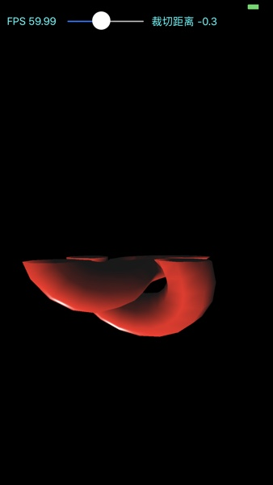
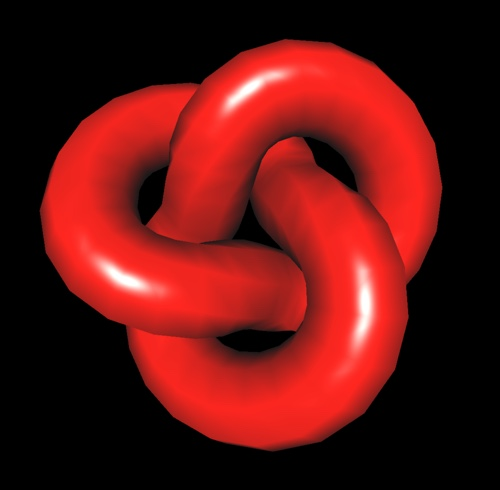

# 实现用户裁切平面（three.js webgl_clipping例子）
three.js中的webgl_clipping例子实现了针对指定用户裁切平面进行裁切的功能。在现代图形管线中，通过API指定用户裁切平面的功能已经废弃。但是这个功能很容易在shader中实现。

## 实现过程
webgl_clpping例子首先实现了环结几何体（torusknot geometry）数据的生成功能，接着使用phong shading对环结几何体进行渲染。随后指定用户裁切平面，在眼睛坐标空间对几何体进行裁切。（three.js在此处借助自己的框架实现优势，实现了更加复杂的场景。在例子中不仅轻松添加了阴影效果，并同时实现了对用户裁切平面功能在所有shader上的动态支持）

模仿webgl_clipping例子，只从实现用户裁切平面的角度，使用C++和OpenGL ES 3.0获得了如下的渲染效果，[iOS版本实现源码](https://github.com/nintymiles/LearnThreeJSRenderingExamples)可以从github上获取。




## Torusknot（环结）几何体生成和渲染
webgl_clipping使用程序生成了torus knot几何体数据，并对其使用phong shading方式进行渲染。

### 1. Torus knot几何体数据的生成
环结几何体使用三角形几何公式依据不同的旋转弧度计算生成。代码如下：

```cpp
/**
* class TorusKnotGeometry constructor
* @param radius 整个torus knot环形结几何体的半径
* @param tube   环形结轮廓管道半径
* @param tubularSegments 管道的数据段数
* @param radialSegments  环形几何体横截面的数据段数
* @param p 环形几何体围绕中心轴扭转的圈数
* @param q 环形几何体内部圆环的数量
*
*/
TorusKnotGeometry(float radius=1.0,float tube=0.4,int tubularSegments=64,int radialSegments=8,int p=2,int q=3){
    
    ...
    
    // helper variables
    Cvec3 vertex;
    Cvec3 normal;
    
    Cvec3 P1,P2;
    
    Cvec3 B,T,N;
    
    // 生成顶点，法线和纹理坐标
    // tubularSegments为环结几何体围绕围绕中心轴旋转p圈的角度上所分的段数
    for (int i = 0; i <= tubularSegments; ++ i) {
 
        // u为每个管道端所占据的弧度radian，用以计算当前分段位置出环形曲面上的位置
        float u = (float)i / tubularSegments * p * M_PI * 2;
        
        //P1为当前曲面位置上的点，P2为稍微靠前一点弧度曲面上的点。
        //这两个点用于生成一个特定的”坐标系“，用于计算正确的顶点位置。
        Cvec3 P1 = calculatePositionOnCurve(u, p, q, radius);
        Cvec3 P2 = calculatePositionOnCurve(u + 0.01, p, q, radius);
        
        //计算出正交标准化的切面空间坐标系[T,B,N]
        //T为P1点上的切线矢量
        Cvec3 T = P2-P1;
        //将P1和P2作为从环结几何体坐标系原点而来的矢量，计算出半路half-way矢量作为法线计算的辅助矢量
        Cvec3 N = P2+P1;
        //计算出半法线bi-normal矢量
        Cvec3 B = cross(T, N);
        //再计算出真正的法线normal矢量
        N = cross(B, T);
        
        //标准化 B, N, T。
        B.normalize();
        N.normalize();
        T.normalize();
        
        for (int j = 0; j <= radialSegments; ++ j ) {

            //注意此处我们在xy-平面塑造形状，无需计算z-值。
            //环结几何体围绕中心轴旋转弧度分段中，每一段的弧度radians
            float v = j / (float)radialSegments * M_PI * 2;
            float cx = -tube * cos(v);
            float cy = tube * sin(v);
            

            //计算添加围绕环结中心轴（z轴）旋转的顶点的最终值
            Cvec3 vertex;
            
            vertex[0] = P1[0] + (cx * N[0] + cy * B[0]);
            vertex[1] = P1[1] + (cx * N[1] + cy * B[1]);
            vertex[2] = P1[2] + (cx * N[2] + cy * B[2]);
            
            vertices.push_back(vertex);
            
            //P1总是位于相关被计算顶点的中心，据此计算法线
            Cvec3 normal=vertex - P1;
            normal.normalize();
            
            normals.push_back(normal);
            
            //纹理坐标的计算
            Cvec2 uv(i / (float)tubularSegments,j / (float)radialSegments);
            uvs.push_back(uv);
            
        }
        
    }
    
    //生成绘制顶点的索引集合
    for (int j = 1; j <= tubularSegments; j ++ ) {
        
        for (int i = 1; i <= radialSegments; i ++ ) {
            
            //索引值
            int a = ( radialSegments + 1 ) * ( j - 1 ) + ( i - 1 );
            int b = ( radialSegments + 1 ) * j + ( i - 1 );
            int c = ( radialSegments + 1 ) * j + i;
            int d = ( radialSegments + 1 ) * ( j - 1 ) + i;
            
            //三角形面
            //indices.push( a, b, d );
            indices.push_back(a);
            indices.push_back(b);
            indices.push_back(d);
            //indices.push( b, c, d );
            indices.push_back(b);
            indices.push_back(c);
            indices.push_back(d);
            
        }
        
    }
```

几何数据生成后，生成对应的vertex buffer object和index buffer object，使用GL_TRIANGLES图元（primitives）类型进行绘制，使用phong shading方式进行着色渲染，效果如下：



## 用户裁切平面的实现
在OpenGL ES 1.1和OpenGL版本中提供固定功能方式的API用于实现裁切平面。但是当使用现代渲染管线（shader方式）时，并不能使用这个API，不过这个功能在shader中很容易实现。实现原理使用平面的数学知识。一个平面可以使用公式$Ax+By+Cz=d$来指定，公式中$(A,B,C)$为平面的法线，随后使用$Dist = (A × P·x) + (B × P·y) + (C × P·z) + D$来计算点$P$到这个平面的距离，如果$Dist>=0$，则认为这个点位于这个平面所指定的半空间之内，不需要被裁切，如果$Dist<0$,则认为这个点位于指定的半空间之外，需要被裁切。

在shader中实现上面的思路时，通常在眼睛坐标系中计算裁切平面，这种裁切效果比较符合人的经验预期。shader相关代码如下：

```glsl
//vertex shader
...
//uniform变量 -- 4X4模型视图矩阵
uniform  mat4      uModelViewMatrix;
//眼睛坐标指定的用户裁切平面数据
uniform  vec4       uUserClipPlane;

//顶点位置
layout(location = 0) in vec3 myVertex;

//顶点到平面的距离变量
out float vDistance;

void main(void){
    vec4 p = vec4(myVertex,1);
    //转换顶点
    vec4 eyePos = uModelViewMatrix * p;
    vec3 ecPosition = eyePos.xyz;
    
    //计算到user clip plane的距离
    vDistance = dot(ecPosition,uUserClipPlane.xyz)+uUserClipPlane.w;
    ...
 }
```

```glsl
//fragment shader
...
out vec4 fragColor;

void main(){
	  //如果位于指定半空间之外，则废弃这个像素
    if(vDistance<0.0)
        discard;
    ...
}
```


