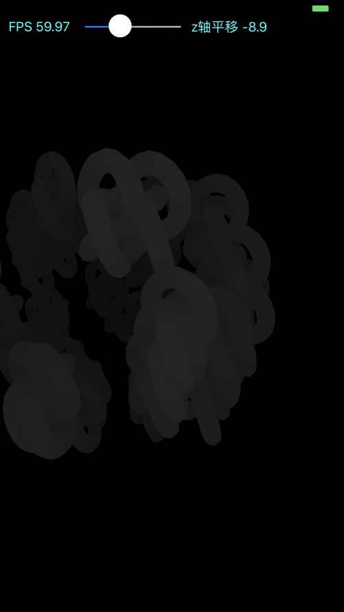

# 深度纹理生成及可视化渲染（three.js webgl_depth_texture例子）
three.js中的webgl_depth_texture例子首先将场景渲染到深度纹理（depth texture）中，随后将深度纹理以可视的方式渲染到屏幕上。

## 实现过程
要将场景渲染到深度纹理中，需要借助framebuffer object（FBO）。通过生成一个FBO，并将其作为渲染目标，然后将特定用途的纹理挂载到FBO对应的color/depth attachment之上，渲染到FBO和渲染到default framebuffer的方式是完全相同的。
当深度纹理渲染完成后，我们想办法将深度纹理中的深度值以可视化的方法进行渲染展示。

模仿webgl_depth_texture例子，实现深度纹理的生成和可视化渲染，使用C++和OpenGL ES 3.0获得了如下的渲染效果，[iOS版本实现源码](https://github.com/nintymiles/LearnThreeJSRenderingExamples)可以从github上获取。


## 渲染到深度纹理
webgl_depth_texture例子首先使用随机的位置和方位数据渲染生成了多个torusknot几何体。这个场景
会被渲染到depth texture中。

正常渲染的场景


渲染生成的深度纹理，用灰度图可视化。


## 深度纹理的可视化渲染
要将深度纹理（depth texture）以可视化方式展示出来，我们需要将深度值转化为灰度（黑白）颜色值。不过要注意，通常深度值的范围比较小，$Z_w \in [0..1]$，当转化为灰度颜色值时，我们将这个深度值分别作为RGB色彩的r/g/b部件值。由于我们采用右手（螺旋）性的坐标系，因而当几何体越接近眼睛时，其值越大。在shader中要生成灰度色彩，我们需要适当缩放调整一下深度值。

```glsl
#version 300 es
precision highp float;

uniform sampler2D tDiffuse;
uniform sampler2D tDepth;

in vec2 vUv;
out vec4 fragColor;

void main() {    
    vec4 depthColor = texture(tDepth, vUv) ;
    //写入的深度值在纹理的r部件中存储。由于深度值的数值较小，可能需要适度的放大。
    fragColor = vec4(depthColor.r * 10.0);
    fragColor.a = 1.0;
    
}
```

在渲染过程中，我们可以通过控制几何体的z值来生成变化的深度值。我们可以看到几何体离眼睛越近时，被渲染几何体的颜色越接近白色，而几何体远离眼睛时，则渲染的颜色逐渐接近并融于黑色。较远时的渲染效果图如下：




