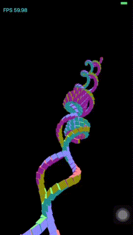
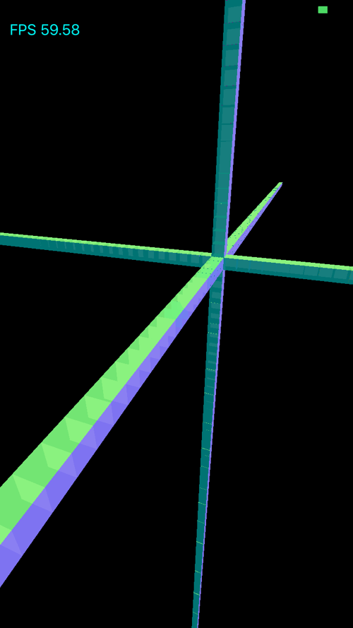

# 层级结构化的3D场景运动变换（three.js webgl_hierarchy2例子）
Three.js中的webgl_hierarch2例子展示了如何进行3D场景的层级结构化矩阵变换。

## 实现过程
webgl_hierarchy2例子中，首先生成了一个拥有众多内嵌子部件的物体，每个子部件的位置和方位都关联于父级部件设置。当父级部件运动时，子部件也会随着父部件运动。要实现这个物体及所有子部件的层级结构化变换，需要借助matrix stack概念。矩阵栈的构造原理，需要借助matrix stack概念。矩阵栈的构造原理为，栈中的每个顶部元素都是copy其下部矩阵元素并串接当前变换矩阵。另外，webgl_hierarch2例子中还使用了几何法线对立方体进行着色。

这里，我们模仿webgl_hierarchy2例子，使用OpenGL ES 3.0和C++获得了如下的渲染效果，[iOS版本实现源码](https://github.com/nintymiles/LearnThreeJSRenderingExamples)可以从github上获取。


## 实现层级结构化的几何体物体表达和矩阵变换
webgl_hierarchy2例子中的3D物体可以看作是由很多立方体模型构成的“章鱼”，由中心立方体连接六条由依次内嵌的子立方体构成的触须。要表达这样的“章鱼”几何体，我们只需要让一个立方体模型对象继承一个支持父子关系的根对象即可，这个对象的代码示意如下：

```cpp
class Object{
public:
    Object(std::string name = "", Object* parentObj = NULL);
    virtual ~Object();
    
    void SetName(std::string mdlName){ name = mdlName;}
    std::string GetName(){return name;}

    void SetParent(Object* parent = 0);
    void RemoveParent();
    
    void SetChild(Object* child = 0);
    void RemoveFromParentChildList();
    
    Object*  GetParent();
    std::vector<Object*>* GetChildren();

protected:

    //模型名称
    std::string name;

    //父节点
    Object* parent;
    
    //子节点
    std::vector<Object*> childList;
};
```
利用这种继承关系，利用立方体模型我们就可以构造一个复杂的“章鱼”。由于这种模型实际上由众多的立方体模型构成，如果继续由立方体模型完全负责绘制动作会极大的增加图形api调用开销，我们将涉及GPU的图形缓存数据设置和绘制工作交由抽象出的几何体对象负责。代码示例如下：

```cpp
    //着色器状态由所有的立方体模型共享
    shared_ptr<NormalColorShaderState> shaderState;
    shaderState.reset(new NormalColorShaderState());
    
    //立方几何体对象由所有的立方体模型共享
    shared_ptr<Geometry> geometry;
    CubeGeometry cb = CubeGeometry(100,100,100);
    CubeGeometry::CubeVertexData cbVdata = makeCubeVertexData(cb);
    
    int num_vertices_ = (int)cbVdata.vData.size();
    int num_indices_ = (int)cbVdata.iData.size();
    
    vector<VertexPNX> vertices = cbVdata.vData;
    vector<unsigned short> indices = cbVdata.iData;
    geometry.reset(new Geometry(&vertices[0],&indices[0],num_vertices_,num_indices_));
    
    //每条触须的立方体模型数量
    int amount = 100;
    
    //中心根立方体模型
    rootObj = new CubeModel(NULL,geometry,shaderState);
    rootObj->position = Cvec3(1000,0,0);
    rootObj->scale = vec3(1,1,1);
    rootObj->UpdateMatrixWorld();
    rootObj->matrixStatck = matrixStack;
    
    Object *parentObj = rootObj;
    //每个循环生成一条触须，每个触须都是根立方体模型的子部件
    for(int i = 0; i < amount; i ++){
        CubeModel *model = new CubeModel(parentObj,geometry,shaderState);
        model->position = Cvec3(100,0,0);
        model->scale = Cvec3(1,1,1);
        model->matrixStatck = matrixStack;
        model->setPerspectiveCamera(mainCamera);
        parentObj = model;
    }
    
    //总共生成六条触须
    ... ...

    parentObj = rootObj;
    for(int i = 0; i < amount; i ++){
        CubeModel *model = new CubeModel(parentObj,geometry,shaderState);
        model->position = Cvec3(0,0,100);
        model->scale = Cvec3(1,1,1);
        model->matrixStatck = matrixStack;
        model->setPerspectiveCamera(mainCamera);
        parentObj = model;
    }

```

接下来我们考虑，立方体模型如何使用matrix stack数据结构实现层级化变换。matrix stack数据结构是实现层级化变换的基础，其工作原理比较简单，为基本的栈数据结构的使用。一般情况下，每次绘制前，你需要进行matrix stack压栈，首先copy当前的顶部元素，然后在当前位置将顶部元素串接当前外部的参数矩阵。而绘制之后，你需要对matrix stack进行出栈操作，弹出当前的顶部元素。matrix stack的关键代码示意如下：


```cpp
class MatrixStack
{
public:

	MatrixStack();
	~MatrixStack();
	
	//矩阵栈元素初始化操作
	void MatrixStackLoadMatrix(Matrix4 *m);
	
  //压栈操作
	void MatrixStackPushMatrix();
  //出栈操作
	void MatrixStackPopMatrix();
	//为压栈后的部矩阵元素串接当前绘制所需的变换矩阵
	void MatrixStackMultiplyMatrix(Matrix4 *m);
  
   ...
   //获取当前栈中的顶部元素
	Matrix4 *MatrixStackGetTopMatrix();
   
   ...
};
```
绘制立方体时需要使用matrix stack的代码示意如下：

```cpp
 	  //首先压栈
	  matrixStatck->MatrixStackPushMatrix();
	  //将压栈后的顶部矩阵元素串接当前运动参数矩阵
    matrixStatck->MatrixStackMultiplyMatrix(&mat_model_);
    //矩阵栈的使用
    Matrix4 mat_mv = mat_view_ * (*matrixStatck->MatrixStackGetTopMatrix());
    
    GLfloat glmatrix[16];
    mat_mv.writeToColumnMajorMatrix(glmatrix);
    glUniformMatrix4fv(shaderState_->matrix_mv_, 1, GL_FALSE,
                       glmatrix);
    
    ... ...
    
    geometry_->draw(*shaderState_);
    
    for(auto object:*this->GetChildren()){
        CubeModel *model = dynamic_cast<CubeModel *>(object);
        model->Render();
    }
    //出栈
    matrixStatck->MatrixStackPopMatrix();
```

上述步骤实现后，我们只是渲染出一个静态的十字架形状的结构，如下图所示：



要实现webgl_hierarch2例子中的动态螺旋变换效果，还需要设置每条触须中对应几何体模型的运动参数以及观看视角的控制，我们会加入下面的运动控制代码：

```cpp
    float touchX = ( touch_location_x - g_windowWidth ) * 10;
    float touchY = ( touch_location_y - g_windowHeight ) * 10;
		
	  //每帧累加一个固定数值
    timer+=0.005;

    //利用点击像素坐标动态设置相机位置
    cameraPosition = Cvec3(cameraPosition[0]+(touchX -  cameraPosition[0])*0.05,cameraPosition[1]+(- touchY - cameraPosition[1])*0.05,cameraPosition[2]);

	  //先生成眼睛（相机）坐标系矩阵
    Matrix4 mat_eye = Matrix4::makeLookAtEyeMatrix(cameraPosition, Cvec3(0,0,0), Cvec3(0,1,0));
    //再生成view矩阵
    Matrix4 viewMat = inv(mat_eye);

    //每条触须的螺旋运动控制参数
    float rx = sin(timer * 0.7)*0.2*180;
    float ry = sin(timer * 0.3)*0.1*180;
    float rz = sin(timer * 0.2)*0.1*180;

    rootObj->rotation = Cvec3(rx,ry,rz);
    rootObj->UpdateMatrixWorld();

    rootObj->setPerspectiveCamera(mainCamera);
    rootObj->mat_view_ = viewMat;

    //遍历所有子模型对象，设置视图矩阵和螺旋运动参数
    traverse(rootObj,Cvec3(rx,ry,rz),viewMat);
```

## 使用法线为物体着色
对于这次渲染的所有立方体，我们使用一种特别的但是简单的着色方式。利用立方体的法线坐标，将法线坐标从经典立方体域变换为单位立方体域，然后将变换后的坐标值直接作为输出色彩。fragment shader的实现代码如下：

```glsl
#version 300 es
precision highp float;

in vec3 vNormal;
out vec4 fragColor;

vec3 packNormal2Color(in vec3 normal) {
    return normalize(normal) * 0.5 + 0.5;
}

void main() {
    vec3 normalColor = packNormal2Color(vNormal);

    fragColor = vec4(normalColor,0.9);
}
```

经过上述步骤，我们可以获得如下的渲染效果。


